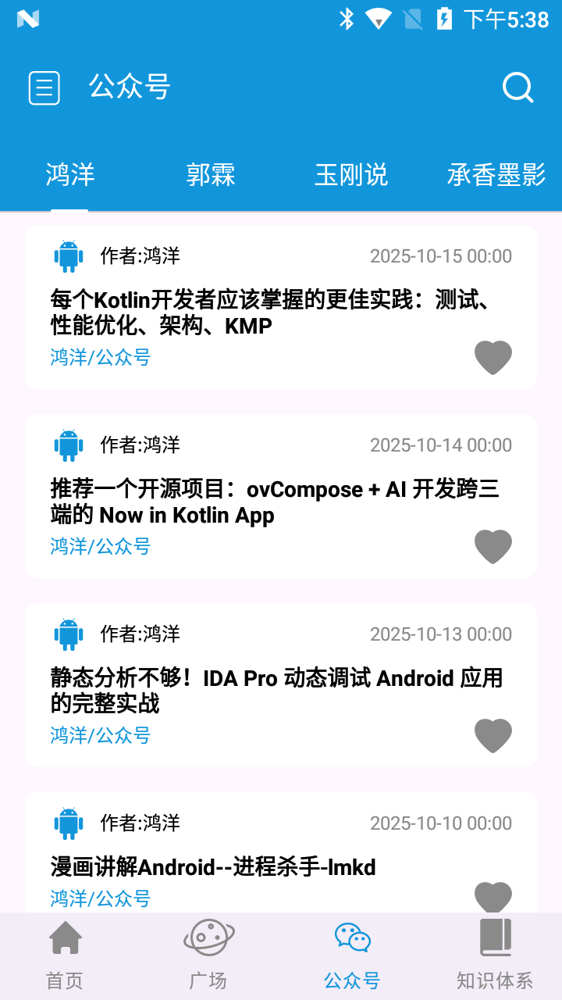
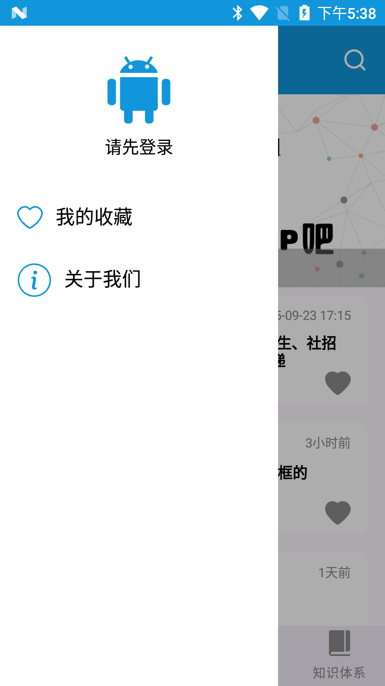
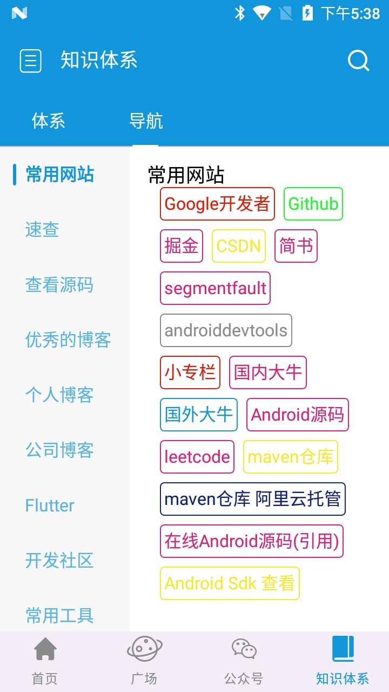
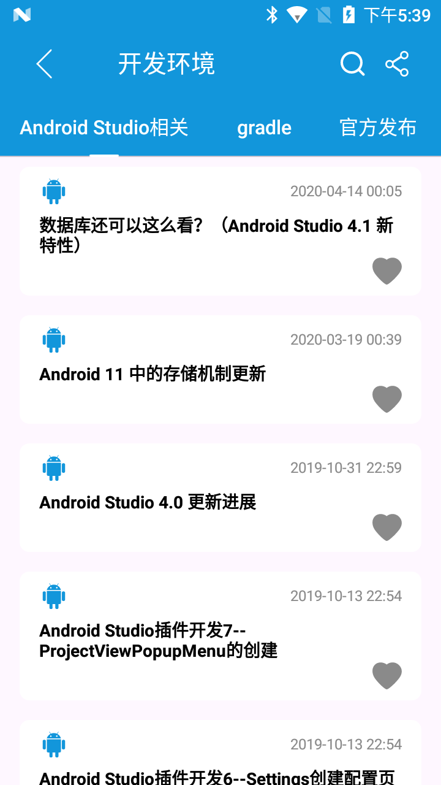

# 玩Android Compose 版

<div align="center">


一个使用 **Jetpack Compose** 和 **Material3** 构建的玩Android客户端，采用现代化的 Android 开发技术栈，提供流畅的用户体验和优雅的代码架构。

[功能特性](#-功能特性) • [技术栈](#-技术栈) • [项目结构](#-项目结构) • [快速开始](#-快速开始) • [截图预览](#-截图预览)

</div>

---

## 📱 项目简介

玩Android Compose 版是一个完全使用 **Jetpack Compose** 开发的玩Android客户端应用，展示了现代 Android 开发的最佳实践。项目采用 **MVVM 架构模式**，代码结构清晰，易于维护和扩展。

本项目旨在为 Android 开发者提供一个学习 Jetpack Compose 和现代 Android 开发技术的参考项目，特别适合：
- 学习 Jetpack Compose UI 开发
- 了解 Material3 设计规范
- 学习 MVVM 架构在 Compose 中的应用
- 参考 Navigation Compose 的使用方式
- 学习 Compose 中的状态管理和数据流

## ✨ 功能特性

### 🎨 UI/UX 特色

- **Material3 设计**：采用最新的 Material Design 3 设计规范，提供现代化的视觉体验
- **流畅的页面动画**：自定义页面切换动画，支持左右滑动切换效果
- **智能导航栏**：BottomBar 根据滚动状态自动显隐，提供沉浸式阅读体验
- **下拉刷新 & 上拉加载**：基于 Material3 PullToRefresh 实现的下拉刷新，支持自动加载更多
- **侧边抽屉导航**：支持侧边栏导航，方便快速切换功能模块
- **滚动联动效果**：TopBar 与内容区域联动，提供流畅的滚动体验

### 🏗️ 架构特色

- **模块化导航**：采用模块化的导航配置，代码组织清晰，易于维护
- **统一状态管理**：自定义导航状态管理，统一处理导航相关状态
- **可复用组件**：封装了 `RefreshableLazyList`、`VerticalScrollableTabRow` 等通用组件
- **MVVM 架构**：清晰的分层架构，Repository 层处理数据，ViewModel 层管理状态

### 📦 功能模块

- **首页**：Banner 轮播、置顶文章、文章列表
- **知识体系**：知识分类浏览、详情查看
- **导航**：网站导航功能
- **搜索**：文章搜索功能
- **广场**：用户广场动态
- **微信文章**：微信公众号文章浏览
- **账户**：用户登录、个人信息管理
- **关于我们**：应用信息展示

## 🛠️ 技术栈

### 核心框架

- **Jetpack Compose** - 声明式 UI 框架
- **Material3** - Material Design 3 组件库
- **Navigation Compose** - 导航框架
- **ViewModel** - 状态管理
- **Lifecycle** - 生命周期感知组件

### 依赖库

- **Coil** - 图片加载库（Compose 版本）
- **Kotlin Coroutines** - 协程支持
- **Kotlin Flow** - 响应式数据流
- **Gradle Version Catalog** - 依赖版本管理

### 开发工具

- **Kotlin 2.3.0** - 编程语言
- **AGP 8.13.0** - Android Gradle Plugin
- **Compose Compiler** - Compose 编译器插件

## 📁 项目结构

```
app/src/main/java/com/zfx/wanandroidcompose/
├── data/                    # 数据模型
│   ├── Article.kt
│   ├── BannerItem.kt
│   ├── User.kt
│   └── ...
├── feature/                 # 功能模块
│   ├── home/               # 首页模块
│   │   ├── HomeRepository.kt
│   │   ├── HomeViewModel.kt
│   │   └── ui/
│   ├── knowledge/          # 知识体系模块
│   ├── search/             # 搜索模块
│   ├── square/             # 广场模块
│   ├── wechat/             # 微信文章模块
│   └── account/            # 账户模块
├── navigation/             # 导航配置
│   ├── NavGraph.kt         # 导航图定义
│   ├── NavGraphModules.kt  # 模块化导航配置
│   └── NavState.kt         # 导航状态管理
├── ui/                     # UI 组件
│   ├── components/         # 通用组件
│   │   ├── RefreshableLazyList.kt
│   │   ├── BottomNavigationBar.kt
│   │   └── ...
│   └── theme/              # 主题配置
├── network/                # 网络层
│   └── ApiResponse.kt
├── service/                # API 服务
│   ├── HomeService.kt
│   └── ...
├── util/                   # 工具类
│   ├── NavControllerManager.kt
│   └── UserPreferences.kt
├── global/                 # 全局配置
│   └── App.kt
└── MainActivity.kt         # 主 Activity
```


## 🎯 核心实现亮点

### 1. 模块化导航架构

项目采用模块化的导航配置方式，将不同功能的导航配置分离到不同的函数中，提高代码的可维护性：

```kotlin
fun NavGraphBuilder.setupNavigation(...) {
    setupMainNavigation(config)      // 主页面导航
    setupDetailNavigation(config)    // 详情页导航
    setupOtherNavigation(config)      // 其他页面导航
}
```

### 2. 自定义下拉刷新组件

基于 Material3 的 `PullToRefreshBox` 封装了通用的列表组件，支持下拉刷新和上拉加载更多：

```kotlin
RefreshableLazyList(
    items = articleList,
    onRefresh = { viewModel.refresh() },
    onLoadMore = { viewModel.loadMore() }
) { article ->
    ArticleItem(article = article)
}
```

### 3. 智能导航栏显隐

通过监听列表滚动状态，实现 BottomBar 的自动显隐，提供沉浸式阅读体验：

```kotlin
LaunchedEffect(listState) {
    snapshotFlow { listState.firstVisibleItemIndex }
        .collect { index ->
            onToggleBars(index == 0)
        }
}
```

### 4. 统一的状态管理

通过自定义的 `NavState` 统一管理导航相关状态，包括当前路由、BottomBar 显隐等：

```kotlin
val navState = rememberNavState(navController)
```

## 📸 截图预览

<div align="center">

### 首页
展示 Banner 轮播、置顶文章和文章列表，支持下拉刷新和上拉加载更多。


### 公众号
浏览微信公众号文章，支持多个公众号切换查看。



### 侧边抽屉导航
便捷的侧边栏导航，快速访问收藏和关于我们等功能。



### 知识体系
分类浏览开发资源，包括常用网站、优秀博客、开发社区等。



### 广场
用户广场动态，分享优质内容。



</div>

## 📚 学习要点

本项目适合学习以下内容：

1. **Jetpack Compose 基础**：Composable 函数、状态管理、重组优化
2. **Material3 组件**：TopAppBar、BottomNavigationBar、Drawer 等
3. **Navigation Compose**：页面导航、参数传递、深层链接
4. **MVVM 架构**：ViewModel、Repository、数据流管理
5. **自定义组件**：如何封装可复用的 Compose 组件
6. **列表优化**：LazyColumn 的使用、分页加载、下拉刷新
7. **动画效果**：页面切换动画、状态动画

## 🤝 贡献指南

欢迎提交 Issue 和 Pull Request！

1. Fork 本仓库
2. 创建特性分支 (`git checkout -b feature/AmazingFeature`)
3. 提交更改 (`git commit -m 'Add some AmazingFeature'`)
4. 推送到分支 (`git push origin feature/AmazingFeature`)
5. 开启 Pull Request

## 📄 许可证

本项目采用 [MIT License](LICENSE) 许可证。

## 🙏 致谢

- [玩Android API](https://www.wanandroid.com/) - 提供 API 支持
- [Jetpack Compose](https://developer.android.com/jetpack/compose) - UI 框架
- [Material Design 3](https://m3.material.io/) - 设计规范

## 📮 联系方式

如有问题或建议，欢迎通过以下方式联系：

- 提交 [Issue](https://github.com/your-username/WanAndroidCompose/issues)
- 发送邮件：1520870274@qq.com

---

<div align="center">

**如果这个项目对你有帮助，请给一个 ⭐ Star 支持一下！**

Made with ❤️ by [zhufeixiang]

</div>

