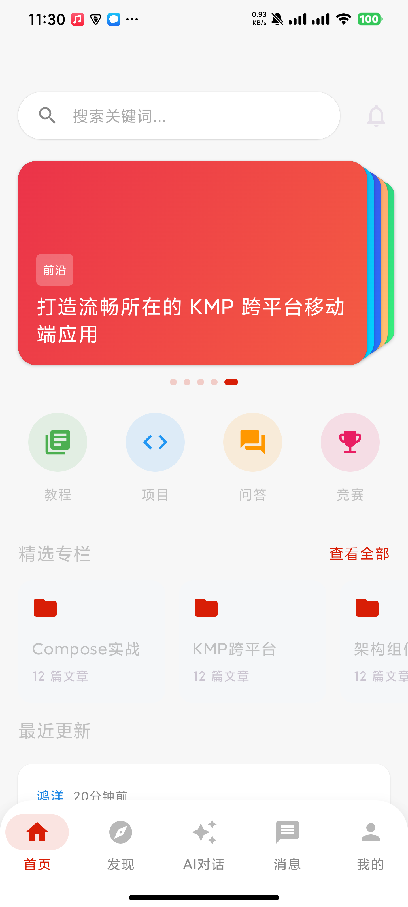
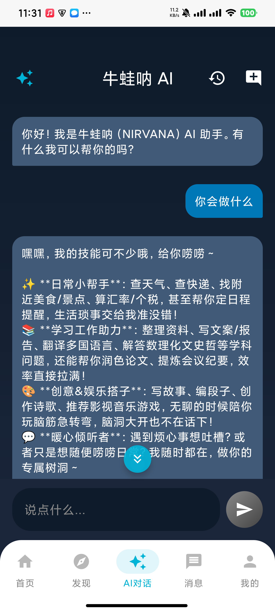
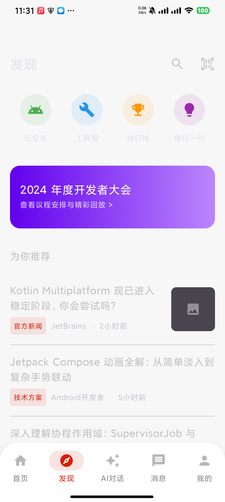
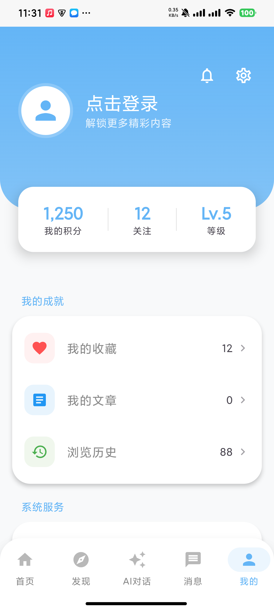

# 🐸 牛蛙呐 (Nirvana)


**牛蛙呐 (Nirvana)** 是一款完全基于 **Jetpack Compose** 构建的现代化 Android 应用。它不仅仅是一个聚合优质技术文章的博客客户端，更深度集成了**AI 智能助手**与**实用工具箱**，致力于为用户提供丝滑、沉浸且极具生产力的移动端体验。

本项目采用最新的 Android 开发范式，采用模块化 (Modularization) 架构，是学习和实践 Compose 落地复杂业务场景的优秀参考。

## ✨ 核心特性

* 🤖 **AI 智能助手 (Nirvana AI)**
    * 深度接入火山引擎大模型 (Responses API)。
    * 支持 SSE (Server-Sent Events) **流式对话打字机效果**，体验极致丝滑。
    * 支持**智能悬停吸底**以及**防键盘遮挡**沉浸式 UI 交互。
    * 基于 Room 数据库的本地对话历史管理。
* 📚 **极客博客与知识库**
    * 每日精选优质技术文章，支持沉浸式阅读与本地收藏。
    * 体系化知识体系与项目分类导航。
* 🧰 **全能工具箱** (持续迭代中)
    * 内置各类开发辅助与日常实用小工具。
* 🎨 **极致 UI 与交互**
    * 100% 采用 Jetpack Compose 构建 UI 界面。
    * 深度适配 Edge-to-Edge 沉浸式状态栏与导航栏。
    * 支持**日间/夜间模式 (Dark Mode)** 无缝动态切换。

## 📸 应用截图

| 首页推荐 | AI 智能助手 | 发现与工具 | 个人中心 |
| :---: | :---: | :---: | :---: |
|  |  |  |  |


## 🛠️ 技术栈

* **开发语言**：[Kotlin](https://kotlinlang.org/)
* **声明式 UI**：[Jetpack Compose](https://developer.android.com/jetpack/compose)
* **架构设计**：MVVM 模式 + 模块化设计 (Module)
* **异步与响应式**：Kotlin Coroutines & Flow
* **网络请求**：[Retrofit](https://square.github.io/retrofit/) + OkHttp3 (处理 RESTful 与 SSE 流式请求)
* **本地数据库**：[Room](https://developer.android.com/training/data-storage/room)
* **数据存储**：DataStore
* **JSON 解析**：Gson

## 🚀 快速开始

### 1. 克隆项目
```bash
git clone [https://github.com/YourUsername/nirvana_compose.git](https://github.com/YourUsername/nirvana_compose.git)
```

### 2. 配置 AI 大模型 API Key (必填项)
为了让 AI 聊天功能正常工作，你需要拥有火山引擎 (Volcengine) Ark 平台的 API Key。
1. 前往火山引擎方舟平台申请你的 `API Key` 以及获取大模型接入点（如 `doubao-seed-...`）。
2. 在项目代码中找到 `VolcNetTool.kt`。
3. 将你的 Key 填入对应的位置：
```kotlin
private val apiKey: String = "你的_API_KEY_填在这里"
private val modelEndpointId: String = "你的_大模型_ENDPOINT"
```

### 3. 编译运行
使用 **Android Studio (推荐 Ladybug 或更高版本)** 打开项目，等待 Gradle 同步完成后，点击 Run 即可在手机或模拟器上运行。

## 🤝 参与贡献

欢迎提交 Issue 报告 Bug 或提出 Feature Request。如果你想为项目贡献代码，欢迎提交 Pull Request！

## 📜 鸣谢与声明

* 本项目的博客文章等部分数据接口来源于优秀的 [WanAndroid API](https://www.wanandroid.com/)。

## 📄 License

```text
Copyright 2026 Nirvana / 牛蛙呐

Licensed under the Apache License, Version 2.0 (the "License");
you may not use this file except in compliance with the License.
You may obtain a copy of the License at

   [http://www.apache.org/licenses/LICENSE-2.0](http://www.apache.org/licenses/LICENSE-2.0)

Unless required by applicable law or agreed to in writing, software
distributed under the License is distributed on an "AS IS" BASIS,
WITHOUT WARRANTIES OR CONDITIONS OF ANY KIND, either express or implied.
See the License for the specific language governing permissions and
limitations under the License.
```